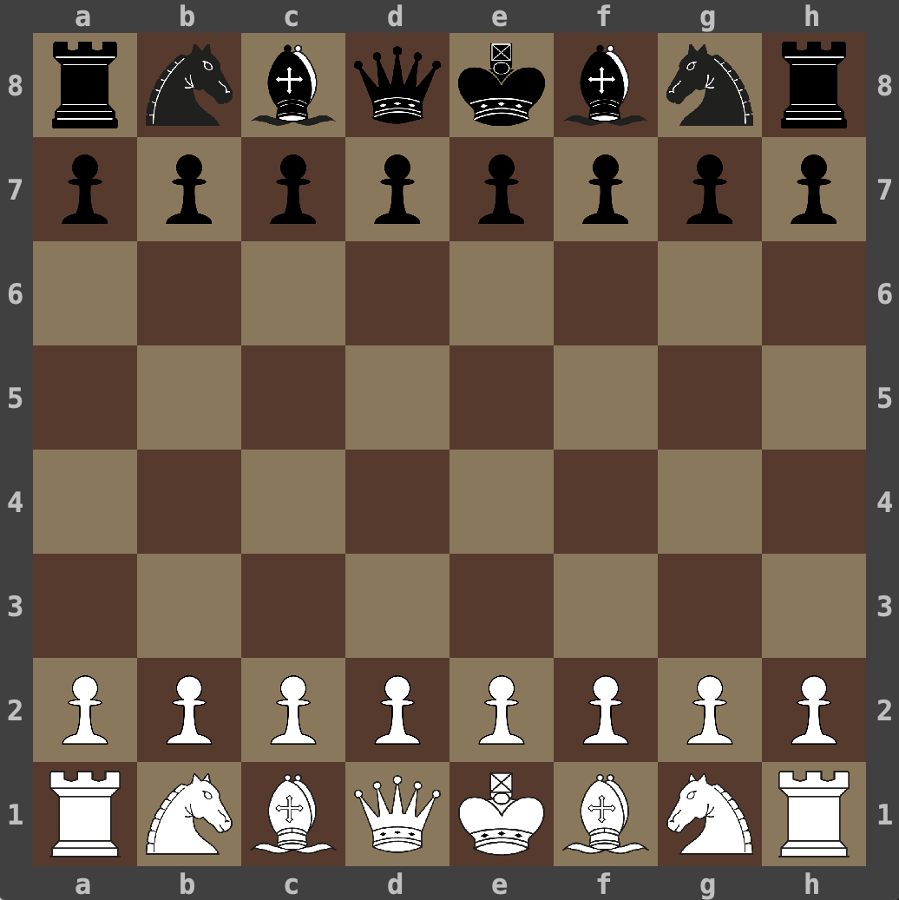

[](https://github.com/jenarros/yagochess/actions/workflows/cd.yml)
# Yet Another Game of Chess

Simple game of chess I initially wrote in Java as part of a Computer Science course in 2003. Recently rewritten in
Kotlin.

Design and implementation details are discussed in the [wiki](https://github.com/jenarros/yagochess/wiki).



## Binary releases

Binary releases for OSX as well as Java 11+ can be found [here](https://github.com/jenarros/yagochess/releases).

## Playing from source

You will need Java 11+ to compile and run the game.

```
git clone git@github.com:jenarros/yagochess.git
cd yagochess
./gradlew yagoc-desktop:runApp
```

## TODO

### Distribution

- Provide windows build

### Performance

- Review if additional performance improvements can be done
- Make alphabeta algorithm iterative

## Gameplay

- Implement checkmate due to repeated configuration 3 times

## UI

- Implement console UI
- Separate debug log from move log

## Open/Save

- Serialize games in plain text instead of binary. Use algebraic notation.
